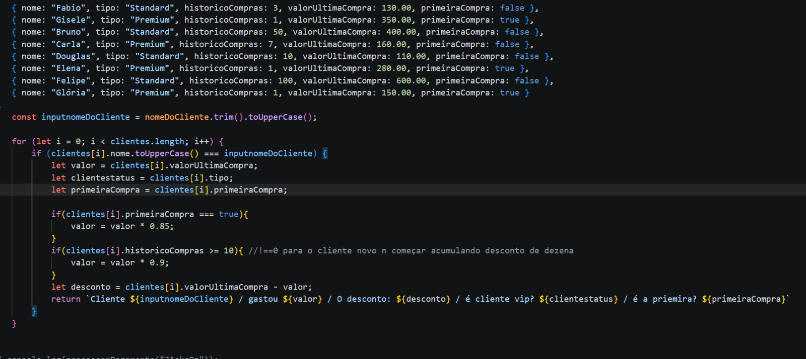
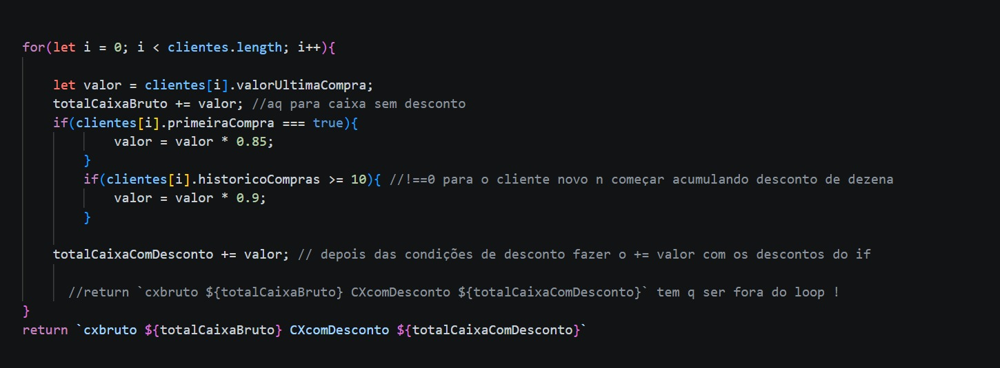
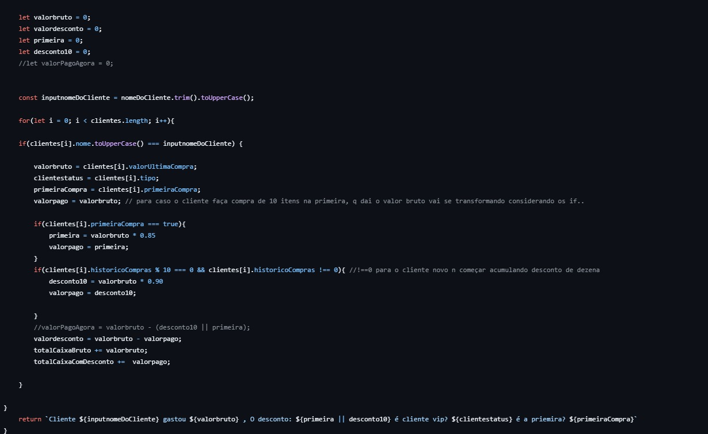

Bom, vou lançar um README despretensioso aqui... e algumas notas que julgo muito importantes sobre meus estudos.

Primeiro, quero desabafar sobre incertezas e medos. Sabe, a realidade atual do mercado me assusta. Estou me formando talvez na pior época para ser um desenvolvedor!? A galera do "vibecoding" vem forte, e empresas acredito que não ligam tanto sobre conhecimento, tendo um site funcional; não importa se a pessoa fez num copy-paste de IA ou se fez entendendo pelo menos essa copy-paste kk

Apesar de que, quanto mais estudo, mais percebo que a IA é uma ótima operária, mas uma péssima arquiteta. Ela é extremamente ruim em SRP (Single Responsibility Principle). A IA olha para a função, não para o sistema... faz muito espaguete.. 

Mas enfim, tenho dois amigos me ajudando nos estudos, que entendem extremamente bem por serem sêniores há anos. Um deles não arruma emprego há cerca de um ano, mesmo entendendo bastante, o que me coloca em conflito ao pensar: "imagina eu...".

Bom, minha área atual(profissão) é Logística, e talvez eu continue nela, mas fui estudar sobre desenvolvimento e acabei realmente curtindo muito. Estudei até um pouco de circuitos eletrônicos para entender o funcionamento físico, kk.

Mas esses pensamentos de estar me esforçando para aprender no pior momento possível não me abandonavam. Até que esses pensamentos surgiram enquanto eu escutava música, e a música específica era Sultans of Swing...

Então, para esquecer toda a angústia de pensar que pode ser inútil estar estudando sistemas a fundo agora, eu foquei na letra. Ela me condicionou, me tocou profundamente. Eu já tinha ouvido e entendido antes, mas, ao parar para escutá-la nesse momento, o significado dela se tornou a resposta para meus sentimentos... Uma banda sem público, sem holofotes. A música descreve personagens dedicados (como "Guitar George" e "Harry") que tocam jazz dixieland e swing, mesmo que o público jovem da época preferisse rock e os ignorasse. Eles estavam ali por amar fazer aquilo, não por dinheiro ou reconhecimento...

Ou seja: estou estudando só para ganhar dinheiro e ter carreira, ou porque eu realmente é algo que quero entender? 
Olha, só quero ser um cara que entende muito bem de códigos e, a longo prazo, ter muitos projetos, entender partes físicas e afins. Porque achei algo que vai muito além de ser apenas a minha profissão...

[formatarParaReal] 
>>>BR $$ 

    const formatador = new Intl.NumberFormat('pt-BR', { //tranformar em BRL                  
    style: 'currency',
    currency: 'BRL'
});             //gostei muito de usar isso em cima do cod e depois ir formatando os retorno 

//

[LEMBRETE] QUANDO NÃO ESTIVER ESTUDANDO LIGAR OS RECURSOS DE ASSISTENCIA DO VSCODE

[Importante], entender a necessidade do cliente é tão importante quanto a parte tecnica, tem que enteder o problema, ter uma visão macro do negocio
ter um planejamento eficiente, tanto de controle de prazos de entrega quanto financeiros, padronização de etapas e modelos, e papel ativo e reativo 
a tudo, saber trabalhar em equipe e definir bem o escopo de cada um para o projeto, e ter muita comunicação para alinhar e não cometer erros que comprometam
entragas, prazos, ou até mesmo a manutenibilidade do projeto.. NEM TODA EMPRESA VAI TER PADRÃO DE PROCEDIMENTOS OU DE "X ACONTECE, FAÇA Y", NA FACULDADE SEMPRE
FALAM DA IMPORTANCIA DISSO, MAS NA PRATICA ISSO NEM SEMPRE VAI OCORRER, POR ISSO TER COMUNICAÇÃO, TANTO COM CLIENTE OU A PONTE COM O CLIENTE DENTRO DA ORG, OU SE 
COMUNICAR COM OS COLEGAS SE TORNA VITAL, PARA DEIXAR TUDO ALINHADO PARA SEGUIR TODOS PARA UM OBJTIVO EM COMUM
>>>>REFINAR ESTUDOS DE UML 
https://www.devmedia.com.br/orientacoes-basicas-na-elaboracao-de-um-diagrama-de-classes/37224

[IMPORTANTE] CUIDAR COM O ERRO SILENCIOSO !! ESSE É O PIOR QUE TEM !! POIS O COD NÃO "APITA" O ERRO, É ERRO DE LOGICA
Estava eu finalizando uma sessão de estudo ai descido dar um scroll para cima para comtemplar os cod realizados, no entanto,
bati o olho num cod que eu fiz, numa funcional mais especificamente, que estava estranho, como ja tinha comentado, que está sendo minha
metodologia, termina o cod e comentar e ir pilando os cod feito kk, eu o descomentei para realizar testes, rodou, mas a logica estava errada!!! 
Basicamente eu tinha uma logica de negocio com condições especificas, ai criei um filtro para ela, ai na hora de fazer os acumuladores tanto de imposto
quanto de valor normal, eu puxei array.reduce , e não variavelFILTRO.reduce , ai os numeros vieram, mas errados, porque eu estava ignorando o filtro
teve outro caso que eu filtrei para tirar os valores 0 e depois ignorei o filtro,  >>
>>const estoque = pecas 
>>.filter((valor, index) => { return valor > 0 } )
>>.reduce((acc, valor) => { return acc + valor * 1.10   },0);
Na hora de fazer a somatotal do estoque, fazer ela na condição ou fora dela daria no mesmo, porque estou desprezando um valor 0 ou negativado..
Mas, logicamente ta errado, vou tem que fazer um total considerando a condição seja de imposto ou de desconto, e o total, até mesmo as 3
Sempre é bom separar e digitar o nome da variavel de maneira bem intuitiva para não ficar ruim de ler depois !!!

[IMPORTANTE] meio confuso o esqueme de imposto, porque {* 1.10 tu da 10% de imposto}, e {* 0.90 tu da 10% de desconto} 
PARA CALCULAR O QUANDO FOI DE IMPOSTO TU N PODE TIRAR 0.90 DO VALOR DO IMPOSTO, 
>> 100 * 1.10 = 110, AGORA PARA CALCULAR A VOLTA N PODE SER [110 * 0.90 = 99] DA RESULTADO DIFERENTE E N DÁ PARA "VOLTAR" IMPOSTO OU CALCULA ASSIM
>> VALORIMPOSTO = IMPOSTO - VALOR   TEM QUE PENSAR QUE TU VAI TER QUE PEGAR O VALOR FINAL DO IMPOSTO E TIRAR O VALOR NORMAL, SÓ ISSO !
>>A porcentagem de "ida" não tem o mesmo peso que a porcentagem de "volta" sobre o valor novo

[IMPORTANTE] ENCADEIAR A FUNCIONAL ??
>>ENCADEIAR QUANDO? QUANDO PRECISO RETORNAR SÓ UM VALOR ESPECIFICO DENTRO DAS CONDIÇÕES ESTABELECIDAS NO ENCADEAMENTO, 
>>PRECISO RETORNAR MAIS COISAS OU LIDAR COM UMA TRATIVA DE DADO FILTRADO QUE ESTA NO MEIO DO ENCADEAMENTE?? AI ESQUECE, SEPARA 

ARRAY É SEMPRE MAP(), FILTER() E REDUCE() !! quer dizer, para fazer algo que exija muita parada, um break no meio, o for ainda vai ser melhor!!!

Entram 10 itens -> Saem 10 itens (mexidos): Use .map().

Entram 10 itens -> Saem 5 itens (iguais): Use .filter().

Entram 10 itens -> Sai 1 valor (total): Use .reduce().

O if / else (O Arquiteto)
Você usa quando a decisão gera uma ação ou bloqueio.

Ação: Salvar no banco de dados, enviar um e-mail, parar a execução.

Clareza: Se você tem 3 ou mais caminhos, o if/else if/else é obrigatório para o código não virar uma "sopa de letras".

Dica de Ouro: Use o if para as "Cláusulas de Guarda" (os erros que matam o código no começo).

 O Ternário (O Estilista) FUNCIONAL
Você usa quando a decisão gera um valor.

Atribuição: Dar nome a uma variável, definir uma cor de um botão, mudar um texto.

Curto: Se a pergunta e as duas respostas cabem em uma linha, o ternário é o rei.

Use a "trindade"(FUNCIONAL) por padrão para manter o código limpo e moderno. 

Migre para o for apenas quando precisar de performance extrema, interrupção antecipada ou controle fino de índices. 

const map = (arr, cb) => {
    const newArr = [];
    for(let i = 0; i < arr.lenght; i++) {
        let e = arr[i];
        newArr.push(
            cb(e, i)
        );
    }
}
    return newArr;

const filter = (arr, cb) => {
    const newArr = [];
    for(let i = 0; i < arr.lenght; i++) {
         if(cb(arr[i], i, arr)) {
             newArr.push(arr[i]);
         }
    }
    return newArr;
}

const reduce = (arr, cb, initial) => {
    let current = arr[0];   
    let indexComeco = 1;   
    const temInicial = initial !== undefined;
    if (temInicial) {
        indexComeco = 0;
        current = initial;
    }
    for(let i = indexComeco; i < arr.lenght; i++) {
        let e = arr[i];
        current = cb(current, e, i);
    }
    return current;
}

SRP NA PRATICA    !!!!!IMPORTANTE

 
 Esse é para busca linear (clientes[i].nome.toUpperCase() === inputnomeDoCliente)

essa é para acumulador 

///////////////=/////////////

esse aqui eu fiz acumulador e busca linear em um só, fica horrivel para manutenção
eu fiz o exercicio e depois pensei "e se eu quiser fazer acumular" ai fiz uma gambiarra para acumular dentro da busca
mas isso foi péssimo, seperar o cod  POR FUNCIONALIDADES UNICAS sempre é melhor e lei, 

Responsabilidade,Função
Busca (Filtro),find/filter,Percorre a lista e entrega o objeto (O Garçom).
Regra (Cérebro),calcDiscount,"Recebe valores, aplica a lógica e retorna (O Lógico)."
Acúmulo (Caixa),reduce/sum,Soma valores brutos e líquidos do array todo (O Contador).
Format (Saída),formatReport,Transforma dados em Strings/R$ para o usuário (A Maquiagem).

